# Moderator Feedback Baseline

| Field          | Value                                                                                                          |
| -------------- | -------------------------------------------------------------------------------------------------------------- |
| **Date**       | 2026-07-23                                                                                                     |
| **Local URL**  | `http://127.0.0.1:8080/game.html`                                                                              |
| **Hosted URL** | `https://www.reddit.com/r/fallstack_dev/?playtest=fallstack`                                                   |
| **Session**    | `fallstack-feedback-baseline`                                                                                  |
| **Scope**      | Rendering clarity, jump intent, UI comprehension, replayable guidance, music, and first-session gameplay rules |

## Summary

| Severity  | Count |
| --------- | ----- |
| Critical  | 0     |
| High      | 0     |
| Medium    | 6     |
| Low       | 0     |
| **Total** | **6** |

## Root-cause and rules experiment

- **Rendering:** the production layout always created a canvas at least 480
  logical pixels wide, then CSS squeezed it into 320–375 px mobile containers.
  Every playfield pixel and 11 px Phaser label was resampled; the effective label
  size at 320 px was roughly 7.3 CSS px. The canvas also ignored device pixel
  ratio, unlike adjacent DOM text.
- **Jump intent:** identical frame-level input is deterministic, but direction
  can change at any point during charge, charging moves the launch origin by up
  to 66 px, and 520 px/s² air steering can reverse a typical half-charge jump.
  Those hidden variables conflict with the settled “arrows nudge the arc” rule.
- **Music:** `unlock()` created the music gain bus before checking whether it
  existed. That made the subsequent `!musicGain` start condition permanently
  false, so no music loop was scheduled after audio unlock.

A disposable terminal prototype compared three movement contracts across short,
half, and full charges with opposed release and air inputs:

| Variant                                                | Predictability | Precision | Correction | Settled-rule fit |     Total |
| ------------------------------------------------------ | -------------: | --------: | ---------: | ---------------: | --------: |
| Current: release-facing + charge crawl + 520 air steer |              1 |         1 |          3 |                1 |      6/12 |
| Locked direction + charge crawl + 240 air steer        |              3 |         2 |          2 |                2 |      9/12 |
| Locked direction + planted charge + 180 air steer      |              3 |         3 |          2 |                3 | **11/12** |

The production direction is therefore **locked and planted**: direction commits
when charge starts, charge does not move the launch origin, and air input remains
a small correction that cannot reverse a normal jump. The throwaway prototype
was removed after recording this decision.

## Verification checkpoints

### 1. Native-size, high-density Phaser rendering

The narrow canvas now uses the container's CSS width as its logical viewport
instead of squeezing the complete 480 px route into view. A horizontally
following camera preserves the full 480 px physics world. The backing canvas
uses device pixel ratio up to 2×, while Phaser's camera keeps world-space physics
unchanged. Essential in-world labels increased from 11 px to 12 px and render at
the backing scale.

- 320×568: backing and CSS canvas are both 320×442 at DPR 1; the artifact
  explanation is now 12 CSS px rather than roughly 7.3 px.
  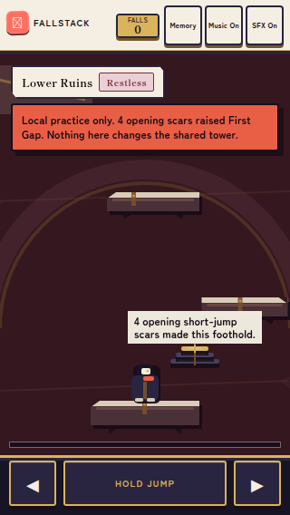
- 375×812: the player, opening artifact, route silhouettes, and community copy
  are no longer miniaturized to fit all 480 world pixels.
  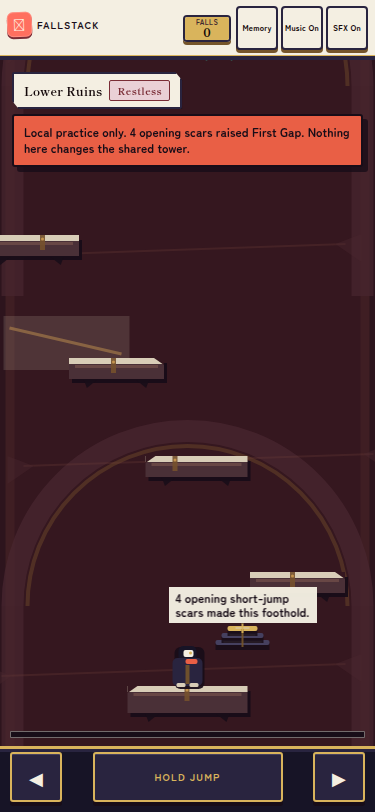
- DPR 2: measured backing canvas 750×1372 for a 375×686 CSS playfield, proving
  the browser receives two backing pixels per CSS pixel.
  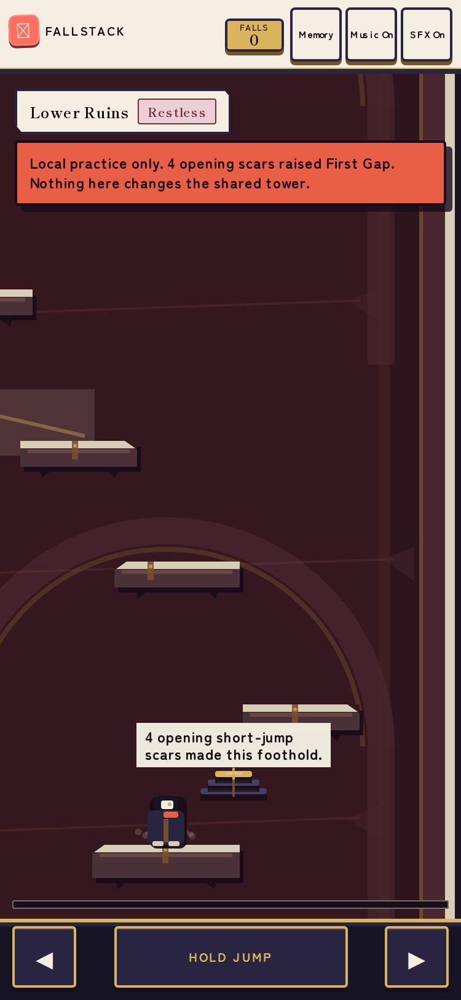
- 1280×800: the 760 px desktop shell remains centered and native-sized.
  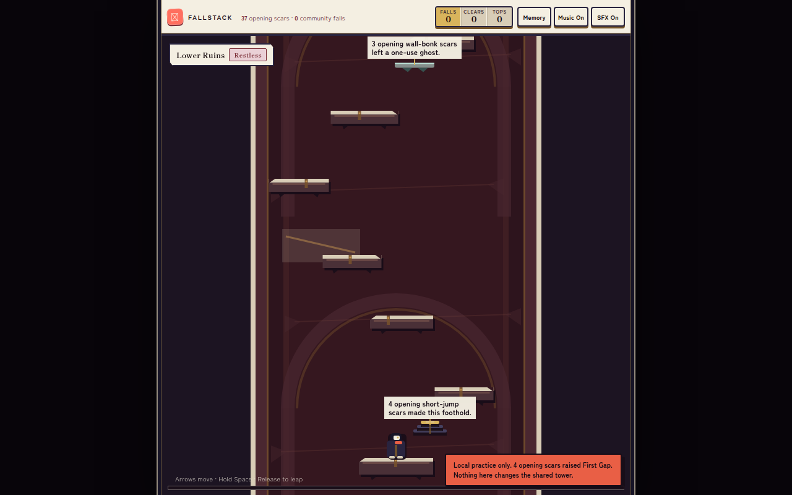
- Real-input smoke: moving, charging, releasing, falling, and respawning
  completed at 320×568; the local fall counter changed `0 → 1` and no unexpected
  runtime error appeared.

Validation: targeted layout tests passed (4/4); full type-check, lint, 137-test
suite, production build, and `git diff --check` passed.

### 2. Committed jump direction and correction-only air input

Charging now commits to the player's facing at charge start and plants the
launch origin until release. Pressing the opposite direction during charge does
not move or flip the impending jump. A five-point in-world arc grows with charge
and ends in a persimmon aim point, exposing both direction and approximate power
before the player commits.

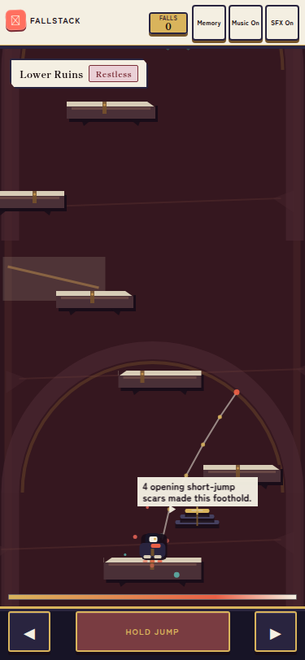
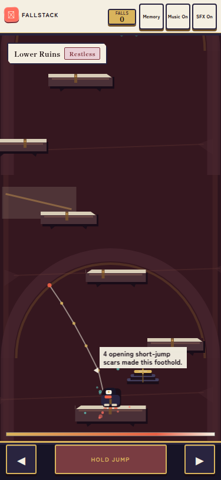

Two fresh rightward trials deliberately held Left during charge. Both emitted
the same structured launch evidence: `direction 1`, `charge 100`, `originX 240`,
`velocityX 460`, and `velocityY -1050`. A mirrored trial held Right during a
leftward charge and emitted `direction -1` from the same origin with exactly
mirrored horizontal velocity. Air steering dropped from 520 to 180 px/s²; the
pure movement test proves a full opposite input cannot reverse even the minimum
charged arc.

Validation: targeted movement tests passed (24/24); full type-check, lint,
138-test suite, production build, `git diff --check`, and real browser
direction-lock trials passed. A real-keyboard production-build playthrough
cleared all 154 route platforms and reached the summit in 232 jumps with 21
recoverable automation failures, 11 checkpoint clears, one summit event, and
zero page errors. The only console error was the expected local `/api` 404 that
activates practice mode. Full landing/event evidence is archived in
[`movement-playthrough-v2/playthrough.json`](movement-playthrough-v2/playthrough.json).
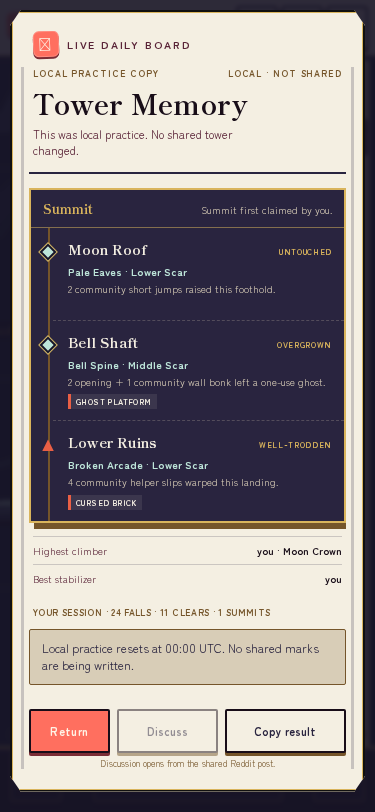

### 3. Quieter HUD, mechanic-first board language, and replayable Guide

The permanent header now contains one community-fall tally plus two reference
actions, Guide and Memory. Clears, summits, Music, and SFX no longer compete with
the first jump; the full board owns aggregate detail, while audio preferences
live in Guide.

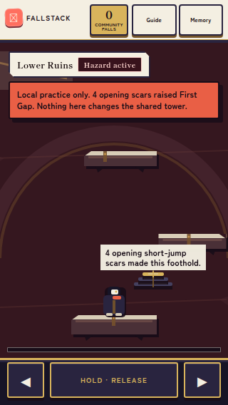
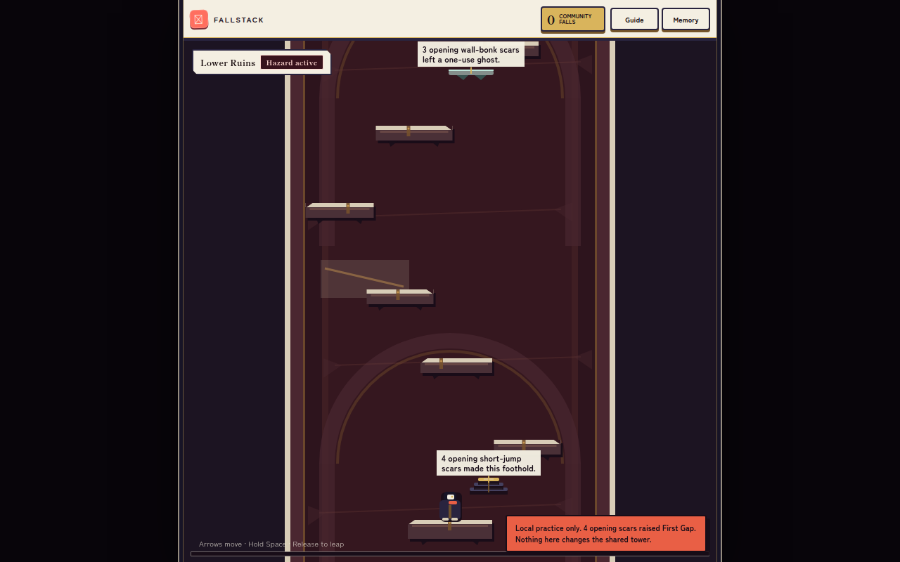

Guide is available before the board finishes loading and on every return visit.
It teaches the complete three-step contract—face, charge, release—then explains
anonymous scars, helpers, ghosts, hazards, clean clears, and checkpoints. It
also contains the two persisted audio preferences. Escape closes and restores
focus to Guide; reopening preserves the changed audio preference. At 320×568
the panel has a 542 px viewport over 666 px of content, exposes `touch-action:
pan-y`, scrolls to the close action, and never traps the player below an
unreachable button.

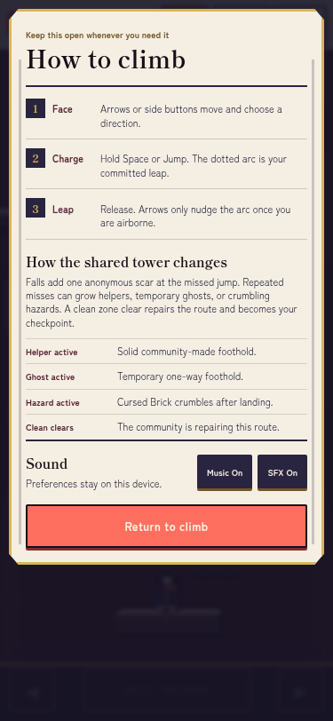
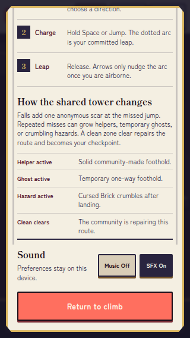

The live HUD and Tower Memory no longer expose `Untouched`, `Restless`,
`Overgrown`, `Well-Trodden`, or `Blessed`. The HUD derives the highest-priority
active mechanic from real artifacts. Memory names each route `Helper active`,
`Ghost active`, `Hazard active`, `Clean clears`, or `No active mark`, then states
the exact collision consequence beneath the causal counter.

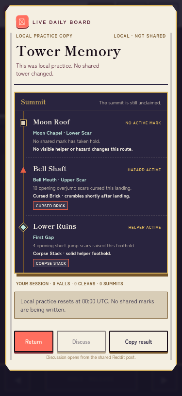

Validation: 24 targeted state/Memory tests, full type-check, lint, 140-test
suite, production build, and `git diff --check` passed. Browser checks passed at
320×568, 375×812, and 1280×800 with non-overlapping header bounds, disabled
climb controls while dialogs are open, focus restoration, persisted audio
preference, mobile vertical scrolling, and no unexpected runtime errors.
Representative text contrast is 12.90:1 for ink/washi, 10.63:1 for
burgundy/washi, and 5.92:1 for muted brown/washi.

### 4. Reliable music start, mute, and restart

`unlock()` previously created the music gain bus and then checked
`!musicGain` before scheduling music. The bus creation made that condition
permanently false. The repaired condition checks the state that actually
matters: music is unmuted, no source nodes exist, and no start is pending. A
regression test protects the initialized-bus/no-sources case and the start path
remains idempotent while muted, pending, or already active.

The pre-load WebAudio probe now observes:

| Step | Contexts | Starts | Stops | Control |
| --- | --- | ---: | ---: | --- |
| Before gesture | suspended / suspended | 2 | 2 | preference on |
| First input + 2.6 s | running / running | 15 | 12 | Music On |
| Music Off + cleanup | running / running | 15 | 15 | Music Off |
| Music On + 2.6 s | running / running | 20 | 17 | Music On |

Turning music off stopped the three persistent drone/pulse sources. Turning it
back on created five new sources: three persistent sources and two scheduled
bells. This directly reverses the baseline failure, where the same off/on cycle
created no oscillator at all. Exact raw observations are archived in
[`audio-fix-metrics.json`](audio-fix-metrics.json). Guide copy now says sound
starts after the first input, avoiding an autoplay claim before browser unlock.
Type-check, lint, the full 142-test suite, production build, and diff validation
all passed.

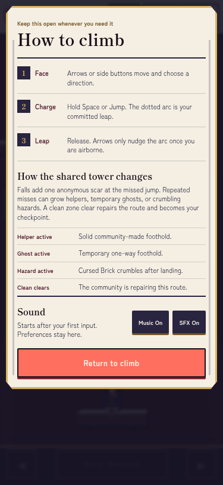

## Issues

### ISSUE-001: Essential Phaser labels are too small and visibly softer than the DOM shell

| Field           | Value                             |
| --------------- | --------------------------------- |
| **Severity**    | medium                            |
| **Category**    | visual / accessibility            |
| **URL**         | `http://127.0.0.1:8080/game.html` |
| **Repro Video** | N/A                               |

**Description**

The community-causality label inside the playfield is essential to the product hook, but it renders as a tiny canvas label at both narrow mobile sizes and in the desktop game column. Its letter edges are visibly softer than the adjacent DOM header and controls, and the multi-line copy requires close inspection. At 320×568 the label competes with the player and opening artifact despite being the only in-place explanation of why the foothold exists.

**Repro Steps**

1. Load the production game at 320×568 and compare the canvas label with the DOM header and touch controls.
   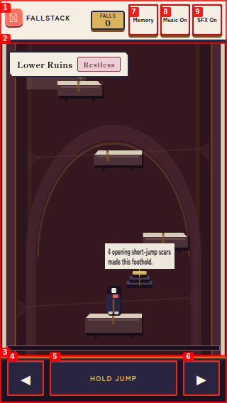

2. Repeat at 375×812; the extra height does not materially improve the label's type size.
   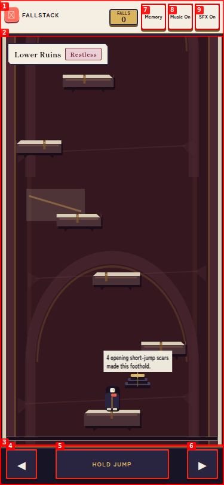

3. Repeat at 1280×800; the narrow logical canvas is scaled inside the desktop frame while the DOM text remains sharper.
   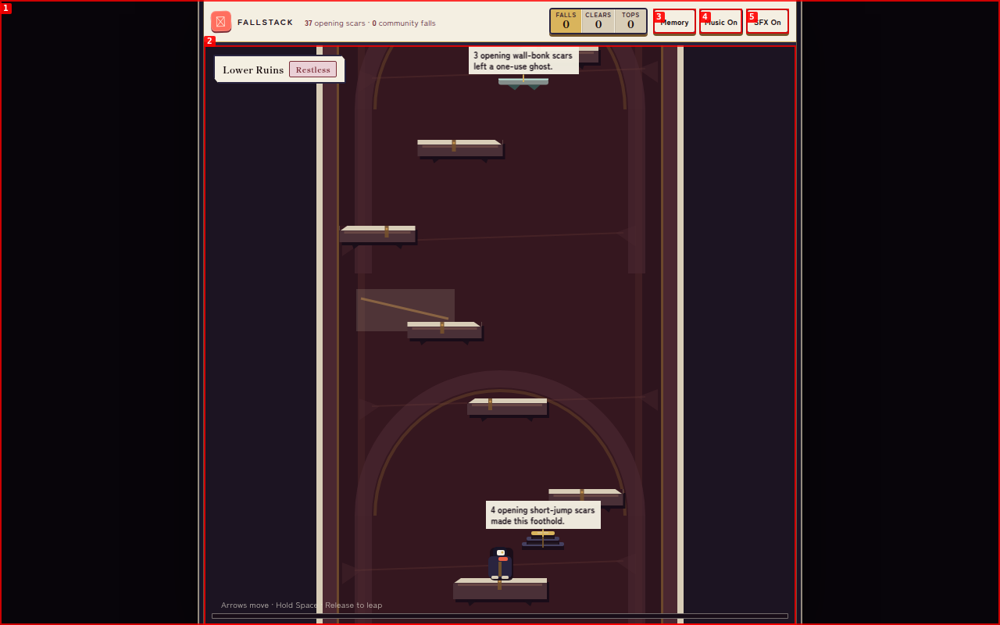

4. Open the authenticated Reddit-hosted game. The same tiny community label and narrow scaled playfield reproduce inside the real expanded modal.
   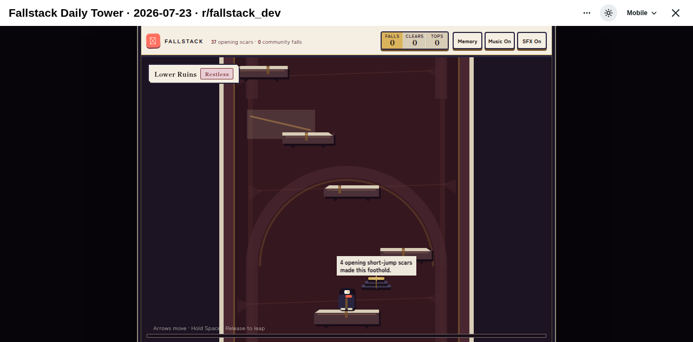

---

### ISSUE-002: The first viewport presents too many equally weighted interface elements

| Field           | Value                             |
| --------------- | --------------------------------- |
| **Severity**    | medium                            |
| **Category**    | visual / ux                       |
| **URL**         | `http://127.0.0.1:8080/game.html` |
| **Repro Video** | N/A                               |

**Description**

Before the player moves, the mobile view gives similar visual weight to the brand mark, Falls, Memory, Music, SFX, zone name, zone state, artifact explanation, three touch controls, and the tower itself. On 320×568 this creates nine prominent bordered regions around a small play corridor. The tower is still visible, but the hierarchy does not tell a first-time player which information is actionable now and which can wait.

**Repro Steps**

1. Load at 320×568 and scan the first viewport before interacting.
   

2. Load at 375×812; the same set of controls remains permanently prominent.
   

---

### ISSUE-003: Daily-board state words describe mood but not rules or consequences

| Field           | Value                             |
| --------------- | --------------------------------- |
| **Severity**    | medium                            |
| **Category**    | content / ux                      |
| **URL**         | `http://127.0.0.1:8080/game.html` |
| **Repro Video** | N/A                               |

**Description**

The opening view labels Lower Ruins as `Restless`, while Tower Memory additionally labels zones `Untouched` and `Overgrown`. The artifact rows explain what accumulated scars produced, but neither view explains what each state changes for the climb or how a player can influence it. A first-time player must infer whether these are difficulty levels, activity labels, visual flavor, or collision rules.

**Repro Steps**

1. Load the opening view and observe `Lower Ruins · Restless` without any consequence copy.
   

2. Open Memory and compare `Untouched`, `Overgrown`, and `Restless`; the labels are not translated into player actions or mechanical effects.
   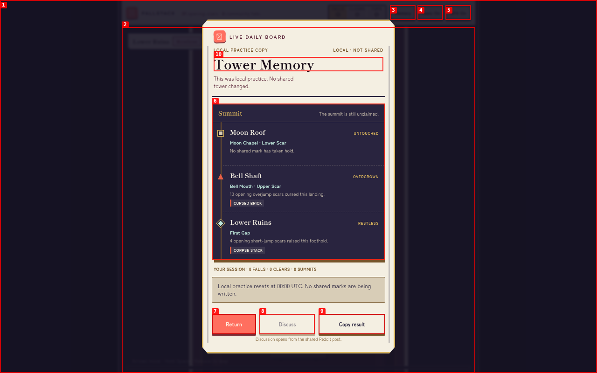

---

### ISSUE-004: Guidance is neither sufficient in the first view nor replayable

| Field           | Value                             |
| --------------- | --------------------------------- |
| **Severity**    | medium                            |
| **Category**    | ux / content                      |
| **URL**         | `http://127.0.0.1:8080/game.html` |
| **Repro Video** | N/A                               |

**Description**

The mobile opening exposes `HOLD JUMP`, but does not explain release-to-leap, when Left/Right sets facing versus nudges the player, or that arrows can alter the arc in flight. Desktop includes one faint bottom-canvas sentence, but there is no Help/How to Play action in the persistent shell or Tower Memory. A player who misses or forgets the initial grammar has no route to relearn it.

**Repro Steps**

1. Load at 375×812 and inspect all persistent actions: Memory, Music, SFX, Left, Hold Jump, and Right. No guidance action is present.
   

2. Open Tower Memory; its actions are Return, Discuss, and Copy result, with no controls or mechanics reference.
   

---

### ISSUE-005: `Music On` can remain silent after audio unlock and an off/on cycle

| Field           | Value                                                             |
| --------------- | ----------------------------------------------------------------- |
| **Severity**    | medium                                                            |
| **Category**    | functional / ux                                                   |
| **URL**         | `http://127.0.0.1:8080/game.html`                                 |
| **Repro Video** | [Music control interaction](videos/issue-005-music-repro-v4.webm) |

**Description**

The persistent control claims `Music On` immediately, even while both WebAudio contexts are suspended by browser autoplay policy. A pre-load AudioContext probe observed one scheduled oscillator and one resume attempt before any gesture, with both contexts still `suspended`. A pointer gesture resumed both contexts, but the one scheduled oscillator stopped and no further oscillator was started. Turning music off and on again, then waiting more than ten seconds, still produced no new oscillator while the UI continued to say `Music On`. This reproduces the moderator's functional observation and also shows that the control reports preference, not audible runtime state.

**Repro Steps**

1. Load with music preference enabled. The UI says `Music On`; the probe reports two suspended contexts, one resume attempt, and one oscillator start.
   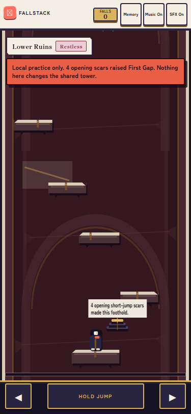

2. Send a pointer gesture into the game. Both contexts become `running`, while the initial oscillator count remains one and its stop count becomes one.
   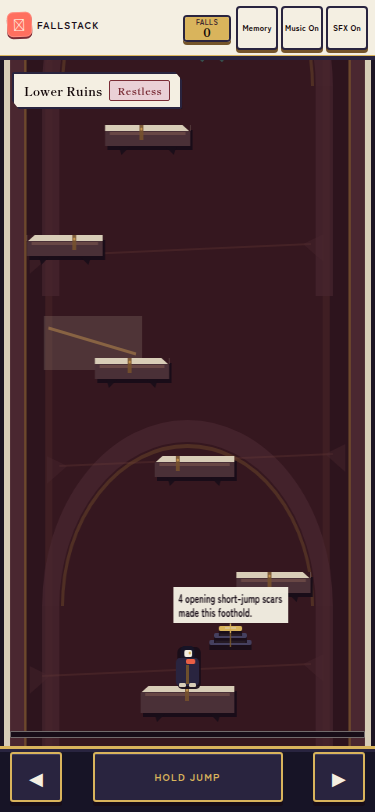

3. Toggle Music off and back on, then wait more than ten seconds. The UI again says `Music On`, but the probe remains at one oscillator start and one stop.
   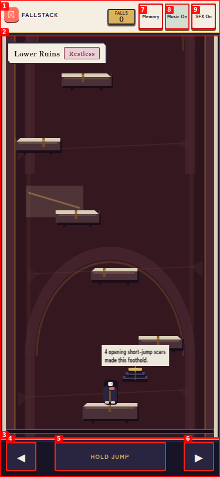

---

### ISSUE-006: Charge strength is visible, but launch direction and directional influence are not

| Field           | Value                                                               |
| --------------- | ------------------------------------------------------------------- |
| **Severity**    | medium                                                              |
| **Category**    | ux / functional                                                     |
| **URL**         | `http://127.0.0.1:8080/game.html`                                   |
| **Repro Video** | [Jump-intent reproduction](videos/issue-006-jump-intent-repro.webm) |

**Description**

The jump button communicates charge amount, but the game provides no equally legible indication of launch direction, carried ground velocity, or whether Left/Right is currently facing, moving, or nudging an airborne arc. In the reproduced mobile sequence, a brief Right press changes the launch state, the avatar's charge pose communicates power only, and release sends the avatar sharply right. Nothing in the persistent copy explains that directional timing can change the trajectory even when the visible jump charge is the same. The system may be deterministic for identical frame-level input, but its important input state is invisible enough to feel random to a first-time player.

**Repro Steps**

1. Load at 320×568. The persistent controls identify Left, Hold Jump, and Right, but expose no current direction or arc behavior.
   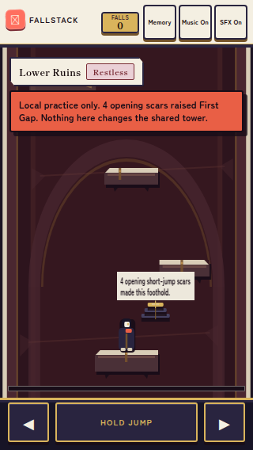

2. Briefly press Right, then hold Jump for 450 ms. The meter and charge pose expose power, but not the impending horizontal component.
   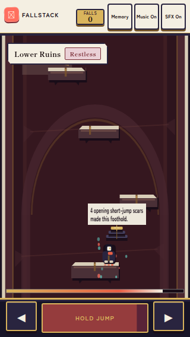

3. Release Jump. The avatar commits to a strong rightward arc with no pre-release trajectory cue.
   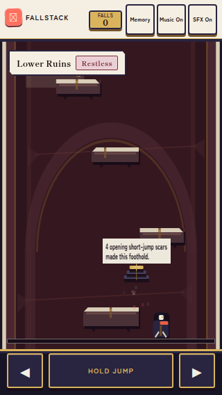

4. The resulting fall increments shared/local mutation, making an unclear control outcome consequential.
   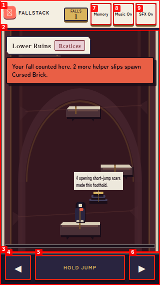

---
