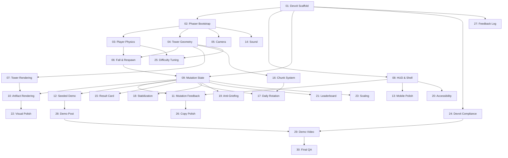

# Fallstack — Implementation Phases

## Overview

30 phases covering the full path from empty project to hackathon submission. Each phase is substantial, self-contained, and builds on what came before without rigid gating.

**Deadline:** July 15, 2026 at 6:00 PM PDT

**Starting state:** Three working HTML mockups, 38 settled design decisions, zero production code.

**Target state:** A polished Devvit interactive post where every Reddit user climbs the same daily tower, their failures physically reshape it, and the community's shared mutation history is immediately visible.

---

## Phase Map

### Foundation (Phases 01–06)
Stand up the project, get Phaser running, and make a character that can jump around a tower.

| Phase | Title | Core Deliverable |
|-------|-------|------------------|
| [01](phase-01-devvit-scaffold.md) | Devvit Web Phaser Scaffold | Working interactive post with Devvit Web entrypoints and API path |
| [02](phase-02-phaser-bootstrap.md) | Phaser Engine Bootstrap | Phaser canvas rendering inside the expanded Devvit Web entrypoint |
| [03](phase-03-player-physics.md) | Player Movement & Jump King Physics | Analog charge jump with commitment feel |
| [04](phase-04-tower-geometry.md) | Tower Structure, Zones & Collision | Three-zone tower with platforms and collision |
| [05](phase-05-camera-system.md) | Vertical Follow Camera | Smooth camera following the climber upward |
| [06](phase-06-fall-respawn.md) | Fall Detection & Respawn | Attempt lifecycle with failure classification |

### Core Mutation Loop (Phases 07–12)
Build the visual identity, the UI shell, and the shared mutation system that IS the game's hook.

| Phase | Title | Core Deliverable |
|-------|-------|------------------|
| [07](phase-07-rendering-tower.md) | Tower Rendering & Visual Identity | Themed zone visuals, atmospheric backgrounds |
| [08](phase-08-hud-shell.md) | HUD, Mobile Controls & Shell | Header, controls, banners, charge indicator |
| [09](phase-09-mutation-state.md) | Shared Mutation State & Persistence | Redis-backed zone counters and artifact derivation |
| [10](phase-10-artifact-rendering.md) | Artifact Rendering & Collision | Five artifact types with distinct visuals/physics |
| [11](phase-11-mutation-feedback.md) | Mutation Feedback Loop | Fall/clear messages that communicate the hook |
| [12](phase-12-seeded-demo.md) | Seeded Demo State | Believable community state for first session |

### Systems & Features (Phases 13–18)
Layer on the systems that make the game feel complete — audio, generation, daily rotation, stabilization.

| Phase | Title | Core Deliverable |
|-------|-------|------------------|
| [13](phase-13-mobile-controls-polish.md) | Mobile Controls Polish | Touch input quality matching keyboard feel |
| [14](phase-14-sound-system.md) | Sound Effects & Audio | Tactile audio feedback for key moments |
| [15](phase-15-result-card.md) | Daily Result Card | Community story summary at summit/session end |
| [16](phase-16-chunk-system.md) | Chunk-Based Generation | Hand-designed chunks stitched into towers |
| [17](phase-17-daily-rotation.md) | Daily Tower Rotation | New seed each day with state lifecycle |
| [18](phase-18-stabilization.md) | Stabilization System | Clear rewards and curse downgrade mechanics |

### Hardening & Polish (Phases 19–24)
Protect the game against abuse, ensure accessibility, build the leaderboard, polish visuals, handle edge cases, and comply with platform requirements.

| Phase | Title | Core Deliverable |
|-------|-------|------------------|
| [19](phase-19-anti-griefing.md) | Anti-Griefing & Rate Limits | Server-side cap enforcement and validation |
| [20](phase-20-accessibility.md) | Accessibility & Reduced Motion | WCAG contrast, keyboard nav, reduced motion |
| [21](phase-21-leaderboard.md) | Leaderboard & Player Identity | Daily achievement tracking and recognition |
| [22](phase-22-visual-polish.md) | Visual Polish & Animations | Particles, screen effects, micro-animations |
| [23](phase-23-scaling-resilience.md) | Scaling & Resilience | Edge case handling and graceful degradation |
| [24](phase-24-devvit-compliance.md) | Devvit Compliance & App Listing | Platform requirements and store submission |

### Finishing (Phases 25–30)
Tune difficulty, polish copy, document feedback, prepare the demo post, create the video, and do final QA.

| Phase | Title | Core Deliverable |
|-------|-------|------------------|
| [25](phase-25-difficulty-tuning.md) | Difficulty Tuning | Physics and layout tuned to target difficulty |
| [26](phase-26-copy-tone.md) | Copy & Tone Polish | All text audited for consistent voice |
| [27](phase-27-feedback-log.md) | Devvit Feedback Log | Structured platform feedback for award track |
| [28](phase-28-demo-post.md) | Demo Post Preparation | Public demo post ready for judging |
| [29](phase-29-demo-video.md) | Demo Video & Submission | Video, Devpost listing, submission packaging |
| [30](phase-30-final-qa.md) | Final QA & Bug Fixing | Systematic testing and last-chance fixes |

---

## How to Use These Phases

**These are guides, not contracts.** The phases describe what to build and why, with enough technical direction to be actionable. They don't prescribe exact stopping conditions or gate you from starting the next phase early.

Things that will happen naturally:
- Phases will overlap. You might start Phase 07 rendering while still tuning Phase 03 physics.
- Earlier phases will get revisited. The physics tuning in Phase 25 changes values from Phase 03.
- Some phases will be faster than expected. Others will surface unexpected problems.
- The chunk generator (Phase 16) might get deprioritized in favor of the locked seed fallback.

Things to protect:
- **The judging path** (Phases 01–12) is the critical path. Everything else supports it.
- **The mutation hook** must be visible in the first 10 seconds. If it isn't, nothing else matters.
- **Mobile quality** is a judging criterion. Don't leave it for last.
- **The deadline** is hard. July 15, 2026 at 6:00 PM PDT. Budget time for submission mechanics.

---

## Git Checkpoint Discipline

Do not let an agent implement multiple phases as one giant uncommitted working tree.

Before starting a phase:

- Run `git status --short`.
- Identify any pre-existing user changes.
- Do not overwrite or revert unrelated user changes.
- If the working tree already contains unrelated edits, either leave them alone or ask before touching the same files.

During a phase:

- Keep changes scoped to the current phase or the explicitly overlapping phase.
- Run the narrowest relevant validation before committing.
- If a phase takes more than one substantial step, create intermediate commits at natural checkpoints instead of waiting for the whole phase to finish.
- Never start the next major phase with a dirty working tree from the previous phase unless the user explicitly asks for stacked uncommitted work.

After a phase is complete:

- Run `git status --short`.
- Review the diff with `git diff`.
- Commit the phase with a boring, descriptive message, for example:
  - `phase 02: bootstrap phaser client`
  - `phase 09: add mutation state persistence`
  - `phase 13: polish mobile controls`
- Include the exact validation command results in the final report or commit notes.

If validation fails:

- Do not commit and call it done.
- Either fix the failure, or make a clearly named WIP commit only if the user explicitly asks for a checkpoint despite failing validation.
- Surface the failing command and the blocker.

Recommended commit boundary:

- One commit per completed phase.
- More than one commit for large phases that touch Devvit scaffold, Phaser runtime, and persistence together.
- No commit should mix unrelated cleanup, speculative refactors, or future-phase work.

---

## Dependencies

## Non-Negotiables (from AGENTS.md)

- The shared mutation hook must be understandable without reading comments.
- No visible "demo mode" labels in the judged path.
- The tower is the hero, not the panels.
- Failure should help, but accumulated failure should distort.
- Do not build anything on the "Do Not Build" list before submission.
